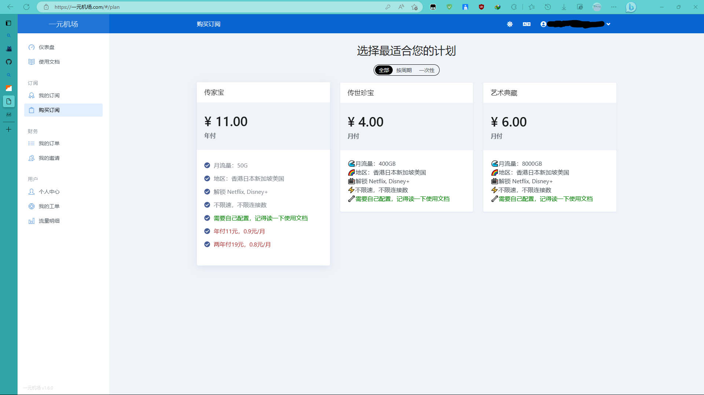

# 世界很大，我想出去看看  

* #### <b>工具下载</b>  
    - 蓝奏云：<https://wwrk.lanzouf.com/ixR9V0w6en1c>  
    密码:43ic  

    ***

    * #### <b>机场推荐</b>
    - 这里给大家推荐两个我用到的机场  

    - 一元机场：<https://xn--4gq62f52gdss.com>    
    &nbsp;&nbsp;&nbsp;&nbsp;&nbsp;&nbsp;&nbsp;&nbsp;&nbsp;&nbsp;&nbsp;&nbsp;&nbsp;&nbsp;&nbsp;&nbsp;&nbsp;&nbsp;官网链接  
    &nbsp;&nbsp;&nbsp;&nbsp;&nbsp;&nbsp;&nbsp;&nbsp;&nbsp;&nbsp;&nbsp;&nbsp;&nbsp;&nbsp;&nbsp;&nbsp;&nbsp;&nbsp;<https://xn--4gq62f52gdss.com/#/register?code=RNT467yq>  
    &nbsp;&nbsp;&nbsp;&nbsp;&nbsp;&nbsp;&nbsp;&nbsp;&nbsp;&nbsp;&nbsp;&nbsp;&nbsp;&nbsp;&nbsp;&nbsp;&nbsp;&nbsp;这是我的邀请链接，你用这个注册之后购买流量会给我反一些佣金😘  
    - <b>介绍</b>  
    一元机场优点是很便宜，流量很多，缺点就是节点数量较少，延迟较大，时不时失联几个节点，适合对延迟没硬性要求，使用较为轻度的用户使用(套餐入下)  
      

    - SOCKBOOM: <https://sockboom.tv/>  
    &nbsp;&nbsp;&nbsp;&nbsp;&nbsp;&nbsp;&nbsp;&nbsp;&nbsp;&nbsp;&nbsp;&nbsp;&nbsp;&nbsp;&nbsp;&nbsp;&nbsp;&nbsp;&nbsp;&nbsp;&nbsp;&nbsp;&nbsp;官网链接  
    &nbsp;&nbsp;&nbsp;&nbsp;&nbsp;&nbsp;&nbsp;&nbsp;&nbsp;&nbsp;&nbsp;&nbsp;&nbsp;&nbsp;&nbsp;&nbsp;&nbsp;&nbsp;&nbsp;&nbsp;&nbsp;&nbsp;&nbsp;<https://sockboom.shop/auth/register?affid=480537>  
    &nbsp;&nbsp;&nbsp;&nbsp;&nbsp;&nbsp;&nbsp;&nbsp;&nbsp;&nbsp;&nbsp;&nbsp;&nbsp;&nbsp;&nbsp;&nbsp;&nbsp;&nbsp;&nbsp;&nbsp;&nbsp;&nbsp;&nbsp;这是我的邀请链接，你用这个注册之后购买流量会给我反一些佣金😘  

    - <b>介绍</b>  
    SOCKBOOM优点是速度很快，延迟低，节点数量多,缺点是流量较少，价格稍微贵一些，如果长期使用的话，记得购买一下VIP，这个是用来解锁VIP节点，购买一次永久有效，这个机场适合用来打打游戏（后面会单独写一下怎么加速游戏），提供较为流畅的使用体验(套餐如下)  
      

***

* #### <b>使用教程</b>  
    - 以一元机场为例，首先购买套餐，然后找到订阅套餐
      
    点击一键订阅，选择导入到clash  
      
    如果失败的话，可以选择复制订阅地址，手动打开clash，然后点击配置  
      
    点击  
    
    点击从URL导入  
      
    将复制的订阅链接粘贴到URL，名称无所谓，自动更新时间设为15即可，点击保存  
      
    选择一元机场，回到主界面  
      
    点击启动  
      
    点击代理，点击进行测速，选择延迟较低的节点（截图的时候忘记测速了），或者选择‘自动选择’即可
      

***

* #### <b>加速游戏</b>  
    - 把此软件挂在后台即可进行加速  