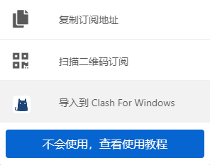

# 世界很大，我想出去看看  

* #### <b>工具下载</b>  
    - 蓝奏云：<https://wwrk.lanzouf.com/iyOoh0vzz8je>  

***  

* #### <b>安装指南</b>  
    - 将下载的压缩包解压后，得到下面两个文件  
  
双击‘Clash.for.Windows.Setup.0.20.23.exe’进行安装  
点击下一步  
  
点击浏览，选择安装位置（默认为C盘，不建议使用默认位置）  
   
选择位置点击确定  
   
点击安装  
   
取消勾选，点击完成  
   

***

* #### <b>汉化步骤</b>
    - 打开你clash的安装路径  
       
    进入resources文件夹  
      
    将你解压出来的‘app.asar’文件复制过来，选择替换  
      

***

* #### <b>机场推荐</b>
    - 这里给大家推荐两个我用到的机场  

    - 一元机场：<https://xn--4gq62f52gdss.com>    
    &nbsp;&nbsp;&nbsp;&nbsp;&nbsp;&nbsp;&nbsp;&nbsp;&nbsp;&nbsp;&nbsp;&nbsp;&nbsp;&nbsp;&nbsp;&nbsp;&nbsp;&nbsp;官网链接  
    &nbsp;&nbsp;&nbsp;&nbsp;&nbsp;&nbsp;&nbsp;&nbsp;&nbsp;&nbsp;&nbsp;&nbsp;&nbsp;&nbsp;&nbsp;&nbsp;&nbsp;&nbsp;<https://xn--4gq62f52gdss.com/#/register?code=RNT467yq>  
    &nbsp;&nbsp;&nbsp;&nbsp;&nbsp;&nbsp;&nbsp;&nbsp;&nbsp;&nbsp;&nbsp;&nbsp;&nbsp;&nbsp;&nbsp;&nbsp;&nbsp;&nbsp;这是我的邀请链接，你用这个注册之后购买流量会给我反一些佣金😘  
    - <b>介绍</b>  
    一元机场优点是很便宜，流量很多，缺点就是节点数量较少，延迟较大，时不时失联几个节点，适合对延迟没硬性要求，使用较为轻度的用户使用(套餐入下)  
      

    - SOCKBOOM: <https://sockboom.tv/>  
    &nbsp;&nbsp;&nbsp;&nbsp;&nbsp;&nbsp;&nbsp;&nbsp;&nbsp;&nbsp;&nbsp;&nbsp;&nbsp;&nbsp;&nbsp;&nbsp;&nbsp;&nbsp;&nbsp;&nbsp;&nbsp;&nbsp;&nbsp;官网链接  
    &nbsp;&nbsp;&nbsp;&nbsp;&nbsp;&nbsp;&nbsp;&nbsp;&nbsp;&nbsp;&nbsp;&nbsp;&nbsp;&nbsp;&nbsp;&nbsp;&nbsp;&nbsp;&nbsp;&nbsp;&nbsp;&nbsp;&nbsp;<https://sockboom.shop/auth/register?affid=480537>  
    &nbsp;&nbsp;&nbsp;&nbsp;&nbsp;&nbsp;&nbsp;&nbsp;&nbsp;&nbsp;&nbsp;&nbsp;&nbsp;&nbsp;&nbsp;&nbsp;&nbsp;&nbsp;&nbsp;&nbsp;&nbsp;&nbsp;&nbsp;这是我的邀请链接，你用这个注册之后购买流量会给我反一些佣金😘  

    - <b>介绍</b>  
    SOCKBOOM优点是速度很快，延迟低，节点数量多,缺点是流量较少，价格稍微贵一些，如果长期使用的话，记得购买一下VIP，这个是用来解锁VIP节点，购买一次永久有效，这个机场适合用来打打游戏（后面会单独写一下怎么加速游戏），提供较为流畅的使用体验(套餐如下)  
      

***

* #### <b>使用教程</b>  
    - 以一元机场为例，首先购买套餐，然后找到订阅套餐
      
    点击一键订阅，选择导入到clash  
      
    如果失败的话，可以选择复制订阅地址，手动打开clash，然后点击配置，将复制的链接粘贴到文本框内，然后点击下载  
      
      
    导入成功后，点击常规，勾选上系统代理即可  
      
    点击代理，可以选择节点，点击进行测速，选择一个延迟较低的节点即可  
    全局模式：无论你打开什么网页都会使用代理  
    规则模式：只代理需要代理的网页  
    直连模式：所有网页均不会经过代理  
    脚本模式：基本用不到  
      

***

* #### <b>加速游戏</b>  
    - 下载Netch工具  
    <https://wwrk.lanzouf.com/ijDb70w26r5i>  
    密码:86ga  
    将下载后的压缩包解压到任意位置，双击打开Netch.exe  
      
      
    首先需要添加服务器，点击’订阅’>’管理订阅’   
      
      
    备注:随意填写  
    链接:复制机场的订阅链接  
    然后点击添加，完成关闭窗口  
      
    点击‘订阅’>‘更新服务器’  
      
      
    如果显示更新了0个服务器，请检查你的订阅链接，部分机场对于不同软件有不同的订阅链接，选择延迟较低的服务器，模式选择[3] Bypass LAN即可，点击启动  
      
    注意右下角NAT:如果显示，代表udp转发失败，不可以用来打游戏，请选择其他服务器。  
    - 下载SSTap工具  
    <https://wwrk.lanzouf.com/ifDSp0w6cc5i>  
    密码:g4fd  
    将下载后的压缩包解压到任意位置，双击‘SSTap-beta-setup-1.0.8.5.exe’进行安装  
      
    选择语言，点击OK  
      
    下一步  
      
    我接受  
      
    点击浏览选择安装位置  
      
    点击安装，第一次安装时会有一个弹窗，选择安装即可  
      
    安装完成  
      
    打开软件SSTap.exe  
      
    选择接受  
      
    点击按钮选择‘SSR订阅‘>‘SSR订阅管理’，在URL栏添加机场的订阅链接  
      
      
      
      
    关闭窗口,等待更新完成  
      
    选择代理，然后点击按钮进行测试，如果UDP转发通过即可点击连接，进行加速  
      

