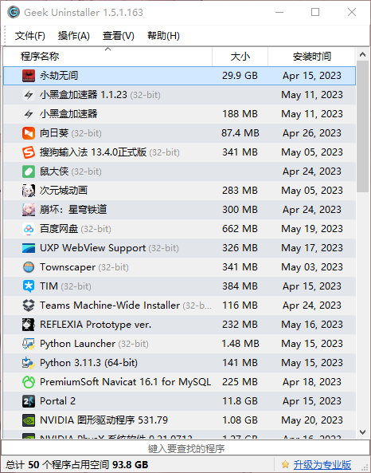

* #### 介绍  
    - Geek卸载软件是一款免费、高效、快速、干净的卸载工具  

* #### 优点  
    - Geek卸载软件可以深度扫描并移除所有残留文件，保持电脑清洁
    - Geek卸载软件可以强制卸载顽固和损坏的程序，支持本地化和微软商店应用的卸载
    - Geek卸载软件有简洁美观的用户界面，支持40多种语言，不需要安装，可以随身携带  
    - Geek卸载软件还有搜索功能，可以通过谷歌搜索不清楚的程序  

* #### 下载  
    - 蓝奏云：<https://wwrk.lanzouf.com/i2FP10xboati>  
    密码:h07q  

* #### 使用  
    - 直接打开Geek，无需安装  
     

* #### 功能介绍  
    - 右键想要操作的软件  
        - 卸载——使用应用本身的卸载程序进行卸载，卸载完成后会自动扫描残留文件，可以自行选择是否清除  
        - 修改——部分应用支持，可以重新执行安装程序，修复一些错误
        - 强制删除——对于不能正常卸载的程序进行强力清除，同样会扫描残余文件，可自行选择是否清除  
        - 删除条目——把此程序从Geek列表中清除  
        - 注册表条目——查看此软件的注册表  
        - 安装文件夹——打开此软件的安装位置  
        - 程序网站——打开此软件的官方网站  
        - 通过谷歌搜索——在浏览器中搜索此软件  
